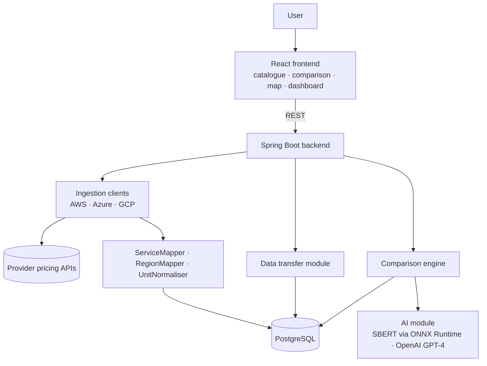

# CloudCompare
### A Cloud Mapping and Migration Analysis Platform

**Compares 1.3 million+ AWS, Azure and GCP service offers on price, compatibility, data-transfer cost and carbon impact, through a single canonical catalogue.**

B.Sc. (Hons) Computer Science dissertation, Lancaster University (2026), supervised by Dr Abdessalam Elhabbash.
**Awarded 100%** and the **Best Final Year Project Prize**, and invited for further development towards academic publication.

📄 [Dissertation (PDF)](write-up/CloudCompare_Dissertation.pdf) 
---

## Why it exists

AWS, Azure and GCP publish their catalogues in incompatible shapes: different naming conventions, billing units, region codes, pricing models and pagination. Existing tools focus on FinOps (monitoring what you already run) rather than **pre-migration analysis**: *what is the equivalent service elsewhere, will it be compatible, what will data transfer cost, and what is its carbon emissions footprint?*

CloudCompare ingests all three providers into one canonical schema, which answers those questions.

## Features

- **Unified catalogue** of 1.3M+ normalised service offers, searchable and filterable by service family, region, billing unit and consumption type
- **Hybrid comparison engine**: rule based filtering finds economically comparable alternatives; **SBERT** semantic similarity and a GPT-4 generated **compatibility report** assess whether they are genuinely equivalent
- **Data-transfer map**: an interactive map of internet egress, intra-region and inter-region transfer costs, with routes inferred from provider SKU descriptions
- **Carbon estimates and A–D ratings** for every offer, using a location-based Scope 2 model, plus an interactive regional emissions map
- **Dashboard** analysing saved offers by price, region, service family and emissions
- **Accounts** with JWT authentication, so users can save offers to a personal library

## Architecture



**Ingestion pipeline:** provider API → JSON parsing and field extraction → canonical mapping (`ServiceMapper`) → region and unit normalisation → upsert into `service_offers` and `prices`. Each run records offers stored, prices upserted, duration and categorised errors in an ingestion manager, which is exposed through admin endpoints.

### Key design decisions

| Decision | Reasoning |
|---|---|
| **Canonical schema + JSONB overflow** | Every provider maps into one relational schema so that comparisons are provider-agnostic. Provider-specific fields that don't fit are kept in a JSONB `specs` column, so no context is lost for semantic analysis. |
| **One ingestion client per provider** | The APIs differ in structure, authentication, pagination and rate limits. Isolated clients keep those differences out of the shared pipeline. |
| **Dedicated region and unit normalisers** | Regions (continent-level vs city-level codes) and billing units (GB vs GiB, hourly vs monthly vs per-request) must be canonical before any price comparison is meaningful. |
| **Rules first, semantics second** | Hard constraints on service family, region group, billing unit and consumption type (e.g. reserved vs on-demand) guarantee economic comparability. SBERT and GPT-4 then check actual compatibility, catching technical differences that filters can't, such as engine versions, OS or CPU architecture. |
| **SBERT in Java via ONNX Runtime** | Runs `all-MiniLM-L6-v2` embeddings inside the Spring Boot service with no separate Python service to deploy. |
| **Location-based carbon accounting** | Reflects the physical grid rather than providers' offset-based claims, so regions can be compared fairly. |

## Carbon model

```
CO₂ (gCO₂e/h) = Watts × PUE × (grid intensity / 1000)
```

- **Grid intensity:** IEA emission factors (2024), refined with EPA eGRID (US) and EEA (Europe) regional averages. A global fallback of ~445 gCO₂/kWh is used where no mapping exists.
- **PUE:** provider-reported values (AWS ~1.15, GCP ~1.10, Azure ~1.18), with 1.20 as the default.
- **Watts:** Cloud Carbon Footprint / SPECpower-derived estimates per offer type (e.g. ~150 W for compute).

## Data model

`services` → `service_offers` (provider, SKU, offer type, region, `specs` JSONB) → `prices` (currency, price, canonical unit), plus `network_transfers` (type, from/to location and region), `users` and `users_saved_offers`.

## Tech stack

| Layer | Technology |
|---|---|
| Backend | Java, Spring Boot, JDBC, JWT (`JwtFilter` / `JwtService`) |
| Database | PostgreSQL (relational + JSONB), parameterised queries, indexed lookups, server-side aggregation |
| Frontend | React, interactive mapping and charting |
| AI | SBERT `all-MiniLM-L6-v2` via ONNX Runtime, OpenAI GPT-4 |
| Deployment | Docker Compose (PostgreSQL · Spring Boot · Nginx), Ubuntu VPS, secrets injected via environment file |

## Repository structure

```
backend/    Spring Boot API: api, catalog, db, ingest, ai, auth, util packages
frontend/   React interface
infra/      Docker / deployment configuration
write-up/   Dissertation material
```

## Running locally

```bash
git clone https://github.com/mattp2004/CloudCompare.git
cd CloudCompare/infra
cp .env.example .env     # PostgreSQL credentials, JWT secret, OpenAI API key
docker compose up --build
```

An OpenAI API key is only needed for compatibility reports. The rest of the platform works without it.

## Results

These results come from the dissertation's evaluation chapter.

**Ingestion**

| Provider | Offers ingested | Duration | Throughput |
|---|---|---|---|
| Azure | 724,979 | 38 min | 316 offers/sec |
| AWS | 530,747 | 28 min | 317 offers/sec |
| GCP | 45,136 | 3 min | 184 offers/sec |
| **Total** | **1,300,862** | | |

Only 1.38% of ingested offers could not be mapped to a canonical offer type. Azure rejected around a quarter of its raw records as schema incompatibilities rather than system failures, which is the main target for improving the canonicalisation rules.

**API latency** (average)

| Query type | Response time |
|---|---|
| Core retrieval (services, saved offers, status) | < 100 ms |
| Filtered catalogue queries over 1M+ offers | ~140–420 ms |
| Rule-based comparison (limit 50) | 165 ms |
| Free-text search / sort by price | ~2.5 s |
| AI compatibility report (SBERT + GPT-4) | ~12 s |

**User study** (8 participants from computing, data science and cloud engineering; 1–5 Likert scale)

| Area | Mean score |
|---|---|
| Core interaction (find, filter, save) | 4.53 |
| Comparison | 4.43 |
| AI compatibility reports | 4.40 |
| Visuals (dashboard, map) | 4.38 |

No participant disagreed with any statement. One participant said the transfer map made it visually clear where the expensive data routes are.

## Next steps 

- **Faster search and sorting:** trigram or full-text indexes for free-text search, and keyset pagination instead of `LIMIT/OFFSET`
- **Cached aggregates:** views for the heaviest map and emissions aggregations (the compute emissions map takes around 10 seconds)
- **Better Azure coverage:** extend the canonical mappings to recover the rejected Azure records
- **Map clarity:** larger price labels and cleaner route rendering, as suggested by study participants
- **Richer carbon model:** real-time grid intensity, and embodied emissions from hardware manufacturing

## Author

**Matthew Pickard** · MSci Computer Science, Lancaster University
[LinkedIn](https://www.linkedin.com/in/matthew-pickard-a302173a6) · [GitHub](https://github.com/mattp2004)
